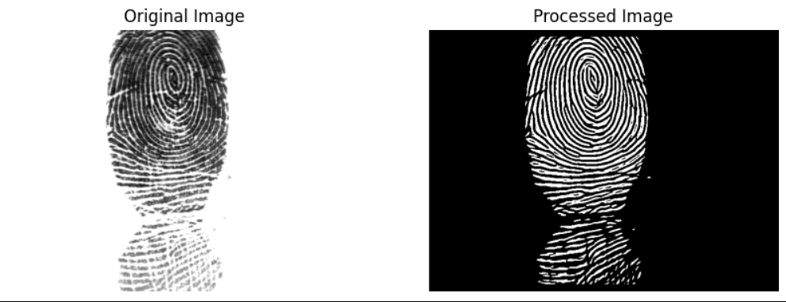

# Biomretric_Group01_Fingerprint

## Todo list (23/12)
- Choose a good dataset 
- Data preprocessing (image enhancement)
    - Testing with Oriented Gabor Filter Bank
    - Find ROI of this example ?
    
    
    - Deal with some rotated image ? 
        - Detect the Orientation: Hough transform, Canny, ...
        - Correct the Rotation
        - Apply ROI

- Extract Level 1 feature: Ridge orientation map, Salient locations (loop or delta,...)
- Extract Level 2 feature: Minutiae (Location, Orientation, Type)
- Level 3 (Optional)
- Authentication algorithm (1 to 1 match or 1 to many)
- How to store into database
- Eating (Lam beoooooooooo vcllllllllll)
## 23/12 -> 25/12
- Writing report
- Slides
- Fine tuning
